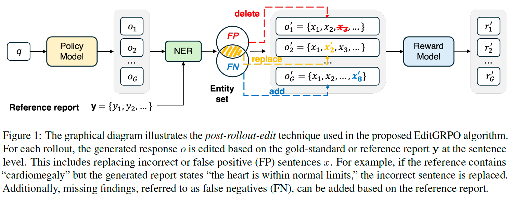
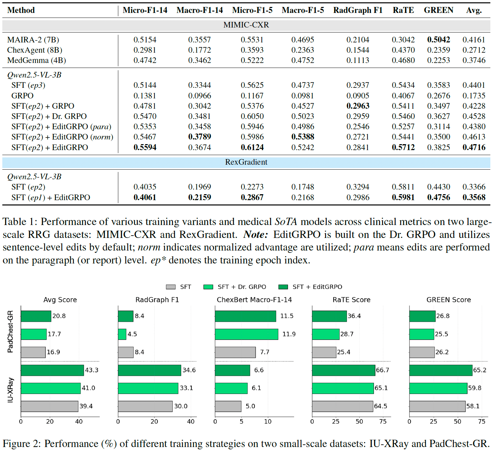

# EditGRPO

**[📖 Read the Paper](EditGRPO_preprint.pdf)** | **[🔗 arXiv](https://arxiv.org/abs/2509.22812)** | **[💻 Code](#quickstart-run-qwen25vl3b-with-editgrpo)**

> **EditGRPO: Reinforcement Learning with Post‑Rollout Edits**  
> * **Clinical alignment gap.**
  Supervised fine-tuning optimizes phrasing, not *clinical correctness*. Models still miss or hallucinate findings; RL lets us optimize *clinically motivated rewards* directly.
> * **Observed failure mode of on-policy GRPO.**
  Pure on-policy rollouts often *collapse to generic reports* (e.g., “no findings”), yielding flat/low-signal advantages and unstable learning.
>* **Core idea & lightweight implementation.**
  During training, apply *minimal sentence-level edits* to each rollout using the gold reference—creating edited trajectories that *guide exploration* while staying close to the policy (stablize training by avoiding excessive policy shift).

> **Practical bits:** no large editor model - rule/NER-driven edits; drop-in for GRPO (uses unnormalized advantages); no inference-time overhead: edits only happen in training; recompute the model logits/log-probabilities on the edited sequence.
<!-- --- -->

## Overview

EditGRPO introduces post‑rollout edits for training vision‑language models to generate clinically accurate chest X‑ray reports. This repository contains the preprint, training scripts, reward server utilities, and evaluation tools, with examples centered on Qwen2.5‑VL‑3B. 

<p align="center">
    
<p>

## Performance

Applied to a Qwen2.5-VL-3B MLLM initialized with supervised fine-tuning (SFT), 
EditGRPO outperforms both SFT and vanilla GRPO baselines, achieving an average
improvement of 3.4% in CheXbert, GREEN, Radgraph, and RATEScore metrics across 
four major chest X-ray report generation datasets.
Notably, EditGRPO also demonstrates superior out-of-domain generalization, with an average
performance gain of 5.9% on unseen datasets.

<p align="center">
    
<p>

## Requirements

### Hardware Requirements

\* *Recommanded for MIMIC‑CXR full‑parameter training with Qwen‑2.5‑VL. Smaller or non-multi-view datasets require fewer resources.*

| Memory                   |   3B   |   7B   |
| ------------------------ | ------ | ------ |
| GPU    | ≥4*80GB | ≥8*80GB |
| CPU    | ≥576GB | ≥576GB |

> [!NOTE]
> Use `worker.actor.fsdp.torch_dtype=bf16` and `worker.actor.optim.strategy=adamw_bf16` to enable bf16 training. `worker.rollout.gpu_memory_utilization=0.7` by default.
>

## Quickstart: Run Qwen2.5‑VL‑3B with Edit‑GRPO

### Installation

Our environment is tested with Python 3.12.

```bash
git clone https://github.com/taokz/EditGRPO.git
cd EditGRPO
conda env create -f reward_env/editgrpo.yml
# You can also use `pip install -r requirements.txt` if you have the conda env with python 3.12.
conda activate editgrpo
pip install -e .
```

### Environment
There are two environment files for reward/evaluation to match model compliance:
> (1) `reward_env/rad_metrics.yml`
> (2) `reward_env/green.yml`

Please use the above files when creating your environment. Because prior implementations did not fully match our reward server usage, we provide modifications under `modified_lib/**`. Overwrite the corresponding default libraries with the versions in `modified_lib/**`.

\* `env/editgrpo.yml` is provided as a reference if you encounter the EditGRPO training environment.

### Training with Edit‑GRPO

#### 1) Start the reward server
```bash
cd flask_server
sbatch run_server_mimic_cxr.sbatch
sbatch run_RaTEscore_extractor.sbatch # for utilizing RaTE NER to extract entity information
```

#### 2) Configure server addresses
Update the server URLs in your configuration files or set environment variables. See `SERVER_CONFIGURATION.md` for detailed instructions.

Example server URLs:
> worker.reward.reward_server='http://REWARD_SERVER_HOST:5000/predict'

> worker.rollout.extractor_server='http://EXTRACTOR_SERVER_HOST:5001/analyze'

#### 3) Launch training

```bash
cd ../ # return to main directory
sbatch examples/mimic_cxr_editgrpo_ops1_para_half_tau_0_6.sbatch
```

### Key arguments
All arguments and hyperparameters are listed in `examples/**.yaml` (3B VL model, multiple datasets). Some key settings are also specified in the `**.sbatch` scripts. Highlights:

    # Enable RaTE NER
    worker.rollout.extractor=True \
    worker.rollout.extractor_server='http://EXTRACTOR_SERVER_HOST:5001/analyze' \
    worker.rollout.extractor_num_ops_per_para=1 \
    worker.rollout.extractor_num_para=-1 \
    worker.rollout.extractor_type="ratescore" \ # use 'radgraph' to enable the RadGraph-based extractor
    worker.rollout.extractor_similarity_threshold=0.6 \ # the \tau threshold for replacement

    # Enable lightweight reward server
    worker.reward.compute_score=rad_server \
    worker.reward.reward_server='http://REWARD_SERVER_HOST:5000/predict' \
    worker.reward.type='free_form' \
    worker.reward.reward_components='["radgraphf1", "cxb14micro", "ratescore"]' \

    # Algorithm settings
    algorithm.force_gt_num=0 \ # number of report-level candidates to be edited per rollout (EditGRPO is sentence-level)
    
    algorithm.loss_agg_mode="seq-mean-token-sum-norm" \ # turns off seq-dim averaging following Dr. GRPO
    algorithm.norm_adv_by_std_in_grpo=False \ # whether to use std in GRPO

## Checkpoint Merge (Hugging Face format)

```bash
python3 scripts/model_merger.py --local_dir checkpoints/editgrpo/exp_name/global_step_1/actor
```

> [!TIP]
> If you encounter issues with connecting to Hugging Face, consider using `export HF_ENDPOINT=https://hf-mirror.com`.
>

## Custom Dataset

Please refer to the example dataset `examples/data/sample_3000_mimic_cxr.json` to prepare your own dataset.

> [!NOTE]
> There are no scripts for supervised fine‑tuning and inference in this repo. For those, we use [ms‑swift](https://github.com/modelscope/ms-swift).

## Evaluation
Please use the reward server environment to perform evaluation. The evaluation code is in `eval/`.

For lightweight evaluation metrics (without GREEN):
```bash
python lightweight_eval.py \
      --data_path "**.json" \ # the output results, including 'id', 'response' (model-generated) and 'answer' (the gold-standard report)
      --save_path "**.csv"
```

For GREEN evaluation:
```bash
python green_eval.py \
    --data_path "**.json" \ # the output result file
    --save_path "**.csv" \
    --model_name_or_path "StanfordAIMI/GREEN-RadLlama2-7b" \
    --use_vllm \ # enable vllm for acceleration
    --batch_size 32 \
    --output_dir "."
```

## Key Logic
- Post‑rollout edits are primarily implemented in `verl/workers/rollout/vllm_rollout/vllm_rollout_spmd.py`.
- Core edit operation logic (RaTE NER–driven replacements) is in `verl/utils/RaTEscore_extractor.py`.

## Acknowledgement
Our EditGRPO is build on top of [EasyR1](https://github.com/hiyouga/EasyR1/tree/main), [verl](https://github.com/volcengine/verl), and [Qwen2.5VL](https://github.com/QwenLM/Qwen2.5-VL).

## Citation

If you find our paper and code useful in your research, please consider giving a star :star: and citation :pencil: :)

```BibTeX
@article{EditGRPO,
  title={EditGRPO: Reinforcement Learning with Post-Rollout Edits for Clinically Accurate Chest X-Ray Report Generation},
  author={Kai Zhang, Christopher Malon, Lichao Sun, Martin Renqiang Min},
  journal={arXiv preprint arXiv:2509.22812},
  year={2025}
}
```
